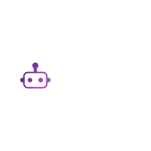

  

## 📘 About
A chatbot for universities! This project is built using containization technologies like Podman, a healthy amount of Python, and Ramalama's integration with Docling for RAG database building and access. The project is hosted locally on-prem at the University Massachusetts Lowell. 

This project is currently undergoing a tech stack migration. 🏗️
 
WIP.

## 🏗 Technologies:

Containers!
  Specifically [Ramalama](https://github.com/containers/ramalama?tab=readme-ov-file#commands)

## 🎉 Acknowledgments

Many thanks to the [UMass Lowell Cloud Computing Club](https://umasslowellclubs.campuslabs.com/engage/organization/cloudcomputingclub) members, our faculty advisor [Dr. Johannes Weis](https://www.uml.edu/sciences/computer-science/people/weis-johannes.aspx), and the [UMass Lowell Computer Science Department](https://www.uml.edu/Sciences/computer-science/) for their support and guidance.

